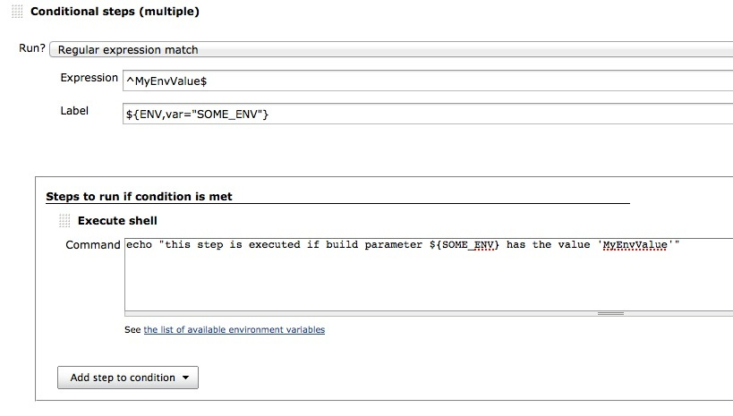
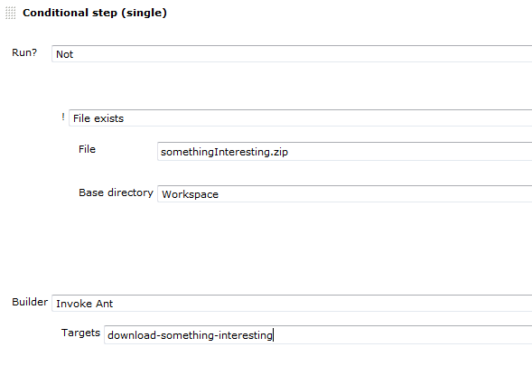
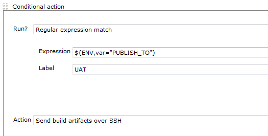
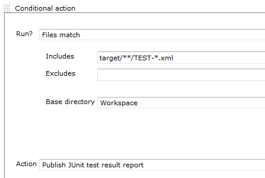
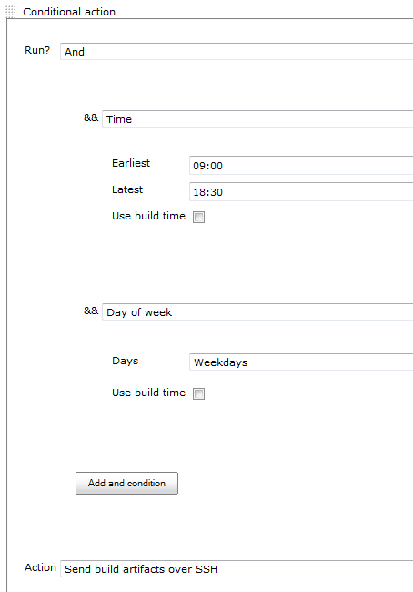
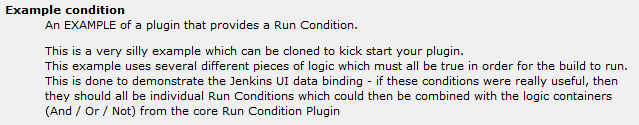

# Run condition plugin

## Features

This plugin defines an ExtensionPoint that can be used by plugins to
define new Run Conditions and to use Run Conditions to decide whether to
run a build step.

This plugin defines a few core Run Conditions:

-   **Always / Never**  
    The always and Never conditions can be used to disable a build step
    from the job configuration without losing the current configuration
    for that build step
-   **Boolean condition**  
    Run the step if a token expands to a representation of true (or the
    string "run")
-   **Current status**  
    Run the build step if the current build status is within the
    configured range
-   **File exists / Files match**  
    Run the step if a file exists, or at least one file matches a
    pattern.
-   **Strings match**  
    Run if the two strings are the same
-   **Numerical comparison**  
    Run the build step depending on the result of comparing two numbers.
    Very useful with tokens
    provided by the "Static Code Analysis
    Plug-ins" that were integrated into the [Warnings Next Generation](https://plugins.jenkins.io/warnings-ng)
-   **Regular expression match**  
    Provide a regular expression and a label. The build step will run if
    the expression matches the label. Both the expression and the label
    are expanded with the [Token Macro
    Plugin](https://plugins.jenkins.io/token-macro/)
    enabling a dynamic (parameterized) regex, label or both.
-   **Time / Day of week**  
    Only run during a specified period of the day, or day of the week.
-   **And / Or / Not**  
    Logical operations to enable the combining and sense inversion of
    Run Conditions
-   **Build Cause**  
    Run the build step depending on the cause of the build e.g.
    triggered by timer, user, scm-change,...
-   **Script Condition**  
    Use shell script to decide whether a step should be skipped
-   **Windows Batch Condition**  
    Use windows batch to decide whether a step should be skipped 

#### Run Conditions are currently used in the following plugins

-   [Build Keeper
    Plugin](https://plugins.jenkins.io/build-keeper-plugin/)
    —
    Select a policy for automatically marking builds as "keep forever"
    to enable long term analysis trending when discarding old builds -
    or use to protect logs and artifacts from certain builds
-   [Conditional BuildStep
    Plugin](https://plugins.jenkins.io/conditional-buildstep/)
    — A buildstep wrapping any number of other buildsteps, controlling
    their execution based on a defined condition.
-   [Run Condition Extras
    Plugin](https://plugins.jenkins.io/run-condition-extras/)
    —
    This plugin provides additional run conditions and integrations for
    [Run Condition
    Plugin](https://plugins.jenkins.io/run-condition/)

## Install

This plugin is used by other plugins and will be installed automatically
when one of those is installed from the Update Center.

To install manually, download the latest plugin from
<http://mirrors.jenkins-ci.org/plugins/run-condition/> and use the
Upload Plugin option in the Advanced tab of the Plugin Manager.  
If you do install manually, you will need to also install the [Token
Macro
Plugin](https://plugins.jenkins.io/token-macro/)
from <http://mirrors.jenkins-ci.org/plugins/token-macro/>.

## Examples

#### Example: Control execution by a string parameter

... this one gets executed if 'SOME\_ENV' (any environment variable)
matches the string 'MyEnvValue'. As any build parameter gets exposed as
an environment variable, the value can be controlled by a parameter.

#### Example: Run a build step if a file **does not** exist

Use the logical **Not** condition, and inside, select **File exists**

#### Example: Use a parameterised build to select which publishers to run

I.e. Set string parameter on a parameterized build to ^(UAT\|DEMO)$ to
run all steps that are labeled with either DEMO or UAT

#### Example: Only publish junit reports if we have some result files

#### Example: Only sound the sirens during work hours

Add an **And** condition and then add **Time** and **Day of week**
conditions to it

## How to contribute a RunCondition to the Run Condition Plugin

This plugin provides an ExtensionPoint which enables other plugins to
provide new Run Conditions to plugins that use them.  
There is an [example plugin](https://github.com/bap2000/jenkins-run-condition-example-plugin) on GitHub.
  
[This](src/main/java/org/jenkins_ci/plugins/run_condition/RunCondition.java) is the RunCondition ExtensionPoint.  
[This one file](https://github.com/bap2000/jenkins-run-condition-example-plugin/blob/master/src/main/java/org/jenkins_ci/plugins/run_condition/example/ExampleCondition.java) contains **all** of the java code in the Example plugin.  
And [this](https://github.com/bap2000/jenkins-run-condition-example-plugin/blob/master/src/main/resources/org/jenkins_ci/plugins/run_condition/example/ExampleCondition/config.jelly) is the XML for the view

## Changelog
For recent versions, see [GitHub Releases](https://github.com/jenkinsci/run-condition-plugin/releases)  
For versions 1.0 and older, see the [CHANGELOG.md](CHANGELOG.md)
